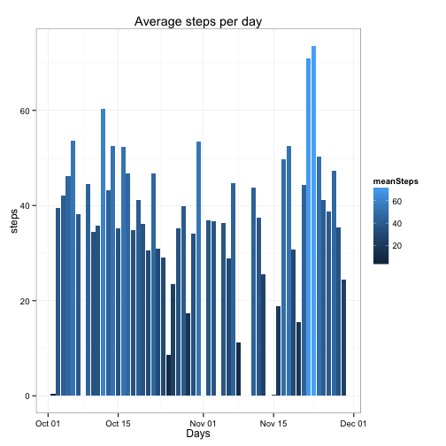
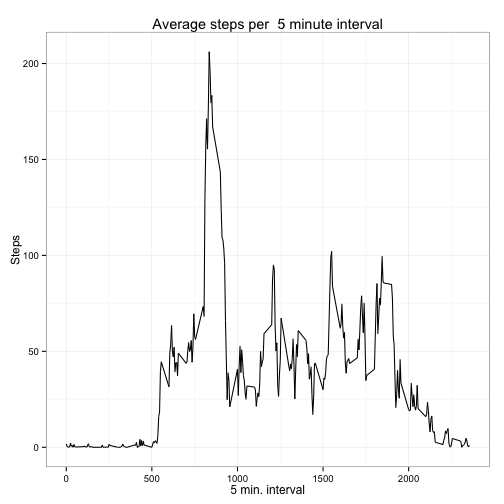
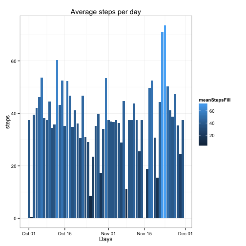
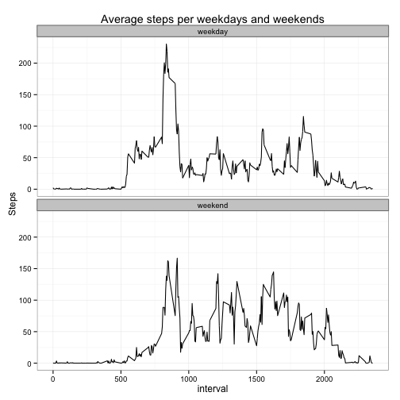

Reproducible research
=====
Peer assignment 1
---------
Loading data into  R using `fread` command from `data.table` packaged

```r
require(data.table)
```

```
## Loading required package: data.table
```

```r
dt <- fread('activity.csv')
```
### 1. What is mean total number of steps taken per day?

#### 1.1 Histogram of average steps per day

```r
dt[,meanSteps:=mean(steps,na.rm=T),by=date]
```

```
##        steps       date interval meanSteps
##     1:    NA 2012-10-01        0       NaN
##     2:    NA 2012-10-01        5       NaN
##     3:    NA 2012-10-01       10       NaN
##     4:    NA 2012-10-01       15       NaN
##     5:    NA 2012-10-01       20       NaN
##    ---                                    
## 17564:    NA 2012-11-30     2335       NaN
## 17565:    NA 2012-11-30     2340       NaN
## 17566:    NA 2012-11-30     2345       NaN
## 17567:    NA 2012-11-30     2350       NaN
## 17568:    NA 2012-11-30     2355       NaN
```

```r
mean.per.day <- unique(na.omit(dt[,list(meanSteps,date)]),by='date')
require(ggplot2)
```

```
## Loading required package: ggplot2
```

```r
ggplot(mean.per.day,aes(x=as.Date(date),y=meanSteps,fill=meanSteps))+geom_histogram(stat='identity')+theme_bw()+ggtitle('Average steps per day')+xlab('Days')+ylab('steps')
```

 

#### 1.2 Mean and median of total steps taken per day

```r
c(mean=dt[,mean(steps,na.rm=T)], median=dt[,median(steps,na.rm=T)])
```

```
##   mean median 
##  37.38   0.00
```

### 2. What is the average daily activity pattern?
#### 2.1 A time series plot of the 5-minute interval and the average number of steps taken

```r
dt[,meanPerDay:=mean(steps,na.rm=T),by=interval]
```

```
##        steps       date interval meanSteps meanPerDay
##     1:    NA 2012-10-01        0       NaN    1.71698
##     2:    NA 2012-10-01        5       NaN    0.33962
##     3:    NA 2012-10-01       10       NaN    0.13208
##     4:    NA 2012-10-01       15       NaN    0.15094
##     5:    NA 2012-10-01       20       NaN    0.07547
##    ---                                               
## 17564:    NA 2012-11-30     2335       NaN    4.69811
## 17565:    NA 2012-11-30     2340       NaN    3.30189
## 17566:    NA 2012-11-30     2345       NaN    0.64151
## 17567:    NA 2012-11-30     2350       NaN    0.22642
## 17568:    NA 2012-11-30     2355       NaN    1.07547
```

```r
ggplot(dt,aes(x=interval,y=meanPerDay))+geom_line()+theme_bw()+ggtitle('Average steps per  5 minute interval')+xlab('5 min. interval')+ylab('Steps')
```

 

#### 2.2 Which 5-minute interval, on average across all the days in the dataset, contains the maximum number of steps?


```r
dt[which.max(dt[,meanPerDay])][,interval]
```

```
## [1] 835
```

### 3. Imputing missing values

#### 3.1 Calculate and report the total number of missing values in the dataset (i.e. the total number of rows with NAs)

```r
dt[,.N,is.na(steps)][1,N]
```

```
## [1] 2304
```

#### 3.2 Devise a strategy for filling in all of the missing values in the dataset. The strategy is average steps per day calculated in 2.1. I use `ifelse` statement to check if `is.na(steps)=TRUE` then replace `NA` with `meanPerDay`.


```r
dt[,fillNA:=ifelse(is.na(steps),meanPerDay,steps)]
```

```
##        steps       date interval meanSteps meanPerDay  fillNA
##     1:    NA 2012-10-01        0       NaN    1.71698 1.71698
##     2:    NA 2012-10-01        5       NaN    0.33962 0.33962
##     3:    NA 2012-10-01       10       NaN    0.13208 0.13208
##     4:    NA 2012-10-01       15       NaN    0.15094 0.15094
##     5:    NA 2012-10-01       20       NaN    0.07547 0.07547
##    ---                                                       
## 17564:    NA 2012-11-30     2335       NaN    4.69811 4.69811
## 17565:    NA 2012-11-30     2340       NaN    3.30189 3.30189
## 17566:    NA 2012-11-30     2345       NaN    0.64151 0.64151
## 17567:    NA 2012-11-30     2350       NaN    0.22642 0.22642
## 17568:    NA 2012-11-30     2355       NaN    1.07547 1.07547
```

#### 3.3 Create a new dataset that is equal to the original dataset but with the missing data filled in.

```r
new.dt <- dt[,fillNA:=ifelse(is.na(steps),meanPerDay,steps)]
```

#### 3.4 Make a histogram of the total number of steps taken each day 

```r
new.dt[,meanStepsFill:=mean(fillNA),by=date]
```

```
##        steps       date interval meanSteps meanPerDay  fillNA
##     1:    NA 2012-10-01        0       NaN    1.71698 1.71698
##     2:    NA 2012-10-01        5       NaN    0.33962 0.33962
##     3:    NA 2012-10-01       10       NaN    0.13208 0.13208
##     4:    NA 2012-10-01       15       NaN    0.15094 0.15094
##     5:    NA 2012-10-01       20       NaN    0.07547 0.07547
##    ---                                                       
## 17564:    NA 2012-11-30     2335       NaN    4.69811 4.69811
## 17565:    NA 2012-11-30     2340       NaN    3.30189 3.30189
## 17566:    NA 2012-11-30     2345       NaN    0.64151 0.64151
## 17567:    NA 2012-11-30     2350       NaN    0.22642 0.22642
## 17568:    NA 2012-11-30     2355       NaN    1.07547 1.07547
##        meanStepsFill
##     1:         37.38
##     2:         37.38
##     3:         37.38
##     4:         37.38
##     5:         37.38
##    ---              
## 17564:         37.38
## 17565:         37.38
## 17566:         37.38
## 17567:         37.38
## 17568:         37.38
```

```r
mean.per.day.filled <- unique(na.omit(dt[,list(meanStepsFill,date)]),by='date')
require(ggplot2)
ggplot(mean.per.day.filled,aes(x=as.Date(date),y=meanStepsFill,fill=meanStepsFill))+geom_histogram(stat='identity')+theme_bw()+ggtitle('Average steps per day')+xlab('Days')+ylab('steps')
```

 

#### 3.5 Calculate and report the mean and median total number of steps taken per day. 


```r
c(mean=new.dt[,mean(fillNA)], median=new.dt[,median(fillNA)])
```

```
##   mean median 
##  37.38   0.00
```

#### 3.6 Do these values differ from the estimates from the first part of the assignment? What is the impact of imputing missing data on the estimates of the total daily number of steps?

I my case, the values are the same, i.e. filling `NA` with the average stpes per day did not introduce any bias in the data. 

## 4 Are there differences in activity patterns between weekdays and weekends?

For this part the weekdays() function may be of some help here. Use the dataset with the filled-in missing values for this part.

#### 4.1 Create a new factor variable in the dataset with two levels – “weekday” and “weekend” indicating whether a given date is a weekday or weekend day.

```r
new.dt[,wkday:=weekdays(as.Date(date))]
```

```
##        steps       date interval meanSteps meanPerDay  fillNA
##     1:    NA 2012-10-01        0       NaN    1.71698 1.71698
##     2:    NA 2012-10-01        5       NaN    0.33962 0.33962
##     3:    NA 2012-10-01       10       NaN    0.13208 0.13208
##     4:    NA 2012-10-01       15       NaN    0.15094 0.15094
##     5:    NA 2012-10-01       20       NaN    0.07547 0.07547
##    ---                                                       
## 17564:    NA 2012-11-30     2335       NaN    4.69811 4.69811
## 17565:    NA 2012-11-30     2340       NaN    3.30189 3.30189
## 17566:    NA 2012-11-30     2345       NaN    0.64151 0.64151
## 17567:    NA 2012-11-30     2350       NaN    0.22642 0.22642
## 17568:    NA 2012-11-30     2355       NaN    1.07547 1.07547
##        meanStepsFill  wkday
##     1:         37.38 Monday
##     2:         37.38 Monday
##     3:         37.38 Monday
##     4:         37.38 Monday
##     5:         37.38 Monday
##    ---                     
## 17564:         37.38 Friday
## 17565:         37.38 Friday
## 17566:         37.38 Friday
## 17567:         37.38 Friday
## 17568:         37.38 Friday
```

```r
new.dt[,weekend:=ifelse(wkday!='Saturday'& wkday!='Sunday','weekday','weekend')]
```

```
##        steps       date interval meanSteps meanPerDay  fillNA
##     1:    NA 2012-10-01        0       NaN    1.71698 1.71698
##     2:    NA 2012-10-01        5       NaN    0.33962 0.33962
##     3:    NA 2012-10-01       10       NaN    0.13208 0.13208
##     4:    NA 2012-10-01       15       NaN    0.15094 0.15094
##     5:    NA 2012-10-01       20       NaN    0.07547 0.07547
##    ---                                                       
## 17564:    NA 2012-11-30     2335       NaN    4.69811 4.69811
## 17565:    NA 2012-11-30     2340       NaN    3.30189 3.30189
## 17566:    NA 2012-11-30     2345       NaN    0.64151 0.64151
## 17567:    NA 2012-11-30     2350       NaN    0.22642 0.22642
## 17568:    NA 2012-11-30     2355       NaN    1.07547 1.07547
##        meanStepsFill  wkday weekend
##     1:         37.38 Monday weekday
##     2:         37.38 Monday weekday
##     3:         37.38 Monday weekday
##     4:         37.38 Monday weekday
##     5:         37.38 Monday weekday
##    ---                             
## 17564:         37.38 Friday weekday
## 17565:         37.38 Friday weekday
## 17566:         37.38 Friday weekday
## 17567:         37.38 Friday weekday
## 17568:         37.38 Friday weekday
```

#### 4.2 Make a panel plot containing a time series plot (i.e. type = "l") of the 5-minute interval (x-axis) and the average number of steps taken, averaged across all weekday days or weekend days (y-axis).


```r
new.dt[,meanPerWkday:=mean(fillNA),by=list(weekend,interval)]
```

```
##        steps       date interval meanSteps meanPerDay  fillNA
##     1:    NA 2012-10-01        0       NaN    1.71698 1.71698
##     2:    NA 2012-10-01        5       NaN    0.33962 0.33962
##     3:    NA 2012-10-01       10       NaN    0.13208 0.13208
##     4:    NA 2012-10-01       15       NaN    0.15094 0.15094
##     5:    NA 2012-10-01       20       NaN    0.07547 0.07547
##    ---                                                       
## 17564:    NA 2012-11-30     2335       NaN    4.69811 4.69811
## 17565:    NA 2012-11-30     2340       NaN    3.30189 3.30189
## 17566:    NA 2012-11-30     2345       NaN    0.64151 0.64151
## 17567:    NA 2012-11-30     2350       NaN    0.22642 0.22642
## 17568:    NA 2012-11-30     2355       NaN    1.07547 1.07547
##        meanStepsFill  wkday weekend meanPerWkday
##     1:         37.38 Monday weekday      2.25115
##     2:         37.38 Monday weekday      0.44528
##     3:         37.38 Monday weekday      0.17317
##     4:         37.38 Monday weekday      0.19790
##     5:         37.38 Monday weekday      0.09895
##    ---                                          
## 17564:         37.38 Friday weekday      2.24864
## 17565:         37.38 Friday weekday      2.24025
## 17566:         37.38 Friday weekday      0.26331
## 17567:         37.38 Friday weekday      0.29686
## 17568:         37.38 Friday weekday      1.41006
```

```r
ggplot(new.dt,aes(x=interval,y=meanPerWkday))+geom_line()+facet_wrap(~weekend,ncol=1)+theme_bw()+ggtitle('Average steps per weekdays and weekends')+ylab('Steps')
```

 

